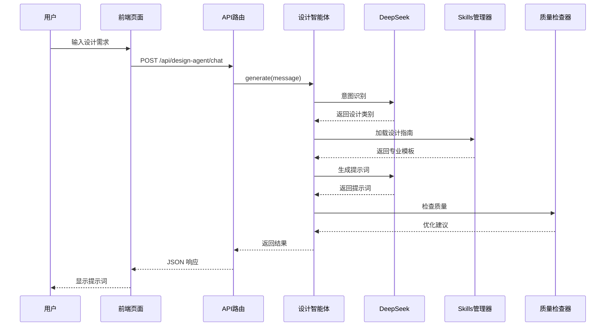

# 秒懂AI设计系统 - 项目结构文档

## 📋 项目概述

这是一个基于 Next.js 的 AI 驱动设计工具平台，集成了 DeepSeek 智能体和专业设计 Skills 系统，能够智能生成各类设计的专业提示词。

## 🏗️ 项目架构

```
用户输入
    ↓
前端页面 (app/design-agent/page.tsx)
    ↓
API 路由 (app/api/design-agent/chat/route.ts)
    ↓
设计智能体 (design-agent/design-agent.ts)
    ↓
┌─────────────┬──────────────┬─────────────┐
│  DeepSeek   │   Skills     │   质量检查   │
│  API 客户端  │   管理器      │   优化器     │
└─────────────┴──────────────┴─────────────┘
    ↓
返回专业提示词
```

## 📁 核心目录结构

```
秒懂AI超级员工【设计系统】/
├── app/                          # Next.js 应用目录
│   ├── api/                      # API 路由
│   │   └── design-agent/
│   │       └── chat/
│   │           └── route.ts      # 设计智能体对话 API
│   ├── design-agent/
│   │   └── page.tsx              # 设计智能体对话页面
│   └── ...                       # 其他页面
│
├── design-agent/                 # 设计智能体核心模块
│   ├── design-agent.ts           # 主控制器
│   ├── deepseek-client.ts        # DeepSeek API 客户端
│   ├── skills-guide-manager.ts   # Skills 管理器
│   ├── quality-checker.ts        # 质量检查器
│   ├── image-analyzer.ts         # 图像分析器
│   ├── design-decision-maker.ts  # 设计决策器
│   ├── omni-design-skills.json   # 设计 Skills 知识库
│   └── types.ts                  # TypeScript 类型定义
│
├── lib/                          # 工具库
│   └── api/
│       └── deepseek.ts           # DeepSeek 工具函数
│
├── components/                   # React 组件
└── .env.local                    # 环境变量配置
```

## 🔄 核心流程详解

### 1. 设计智能体对话流程



### 2. DeepSeek 处理步骤

1. **意图识别** - 分析用户需求，识别设计类别（Logo/插画/海报等）
2. **需求分析** - 检查信息完整性
3. **加载 Skills** - 根据类别加载专业设计指南
4. **生成提示词** - 使用 DeepSeek 生成专业提示词
5. **质量检查** - 评分并优化提示词
6. **返回结果** - 包含提示词、元数据、质量评分

## 🔌 API 接口文档

### POST /api/design-agent/chat

设计智能体对话接口

**请求体：**
```json
{
  "message": "帮我设计一个科技公司的 Logo"
}
```

**成功响应：**
```json
{
  "type": "result",
  "message": "✅ 已识别为【Logo设计】设计...",
  "result": {
    "prompt": "专业的出图提示词...",
    "negativePrompt": "负面提示词...",
    "parameters": {
      "style": "modern",
      "colors": ["blue", "white"]
    },
    "metadata": {
      "category": "Logo设计",
      "confidence": 0.95,
      "designElements": ["科技感", "专业", "创新"],
      "qualityScore": 95
    }
  }
}
```

**错误响应：**
```json
{
  "type": "error",
  "message": "❌ 错误信息"
}
```

## 🎯 核心模块说明

### 1. DesignAgent (设计智能体)
- **文件**: `design-agent/design-agent.ts`
- **功能**: 主控制器，协调所有模块
- **主要方法**:
  - `generate(userInput)` - 基础生成
  - `generateInteractive(userInput, onQuestion)` - 交互式生成
  - `generateFromImage(imageBase64)` - 基于图片生成

### 2. DeepSeekClient (DeepSeek 客户端)
- **文件**: `design-agent/deepseek-client.ts`
- **功能**: 与 DeepSeek API 交互
- **主要方法**:
  - `analyzeIntent()` - 意图识别
  - `analyzeRequirements()` - 需求分析
  - `generatePrompt()` - 生成提示词

### 3. SkillsGuideManager (Skills 管理器)
- **文件**: `design-agent/skills-guide-manager.ts`
- **功能**: 管理设计指南和模板
- **主要方法**:
  - `getCategoryNames()` - 获取所有类别
  - `getSmartGuide()` - 智能选择最佳模板
  - `selectBestTemplate()` - 匹配最合适的模板

### 4. QualityChecker (质量检查器)
- **文件**: `design-agent/quality-checker.ts`
- **功能**: 检查和优化提示词质量
- **主要方法**:
  - `check()` - 质量检查
  - `optimize()` - 优化提示词

## 🚀 快速开始

### 1. 环境配置

创建 `.env.local` 文件：
```bash
# DeepSeek API
DEEPSEEK_API_KEY=your_api_key_here
DEEPSEEK_BASE_URL=https://api.deepseek.com
```

### 2. 安装依赖

```bash
npm install
```

### 3. 启动开发服务器

```bash
npm run dev
```

### 4. 访问应用

打开浏览器访问：
- 设计智能体页面: http://localhost:3000/design-agent

### 5. 测试示例

在对话框中输入：
```
帮我设计一个科技公司的 Logo，名字叫"未来科技"，要体现创新和专业
```

## 📊 支持的设计类别

- 🎨 **Logo 设计** - 品牌标志设计
- 🖼️ **插画设计** - 各类风格插画
- 📰 **海报设计** - 活动/宣传海报
- 📦 **包装设计** - 产品包装
- 🎭 **IP 形象设计** - 卡通形象/吉祥物
- 📱 **UI 设计** - 界面设计
- 🎪 **活动物料** - 展架/易拉宝等

## 🔧 技术栈

- **前端框架**: Next.js 16 + React
- **UI 组件**: Shadcn/ui + Tailwind CSS
- **AI 模型**: DeepSeek Chat API
- **语言**: TypeScript
- **状态管理**: React Hooks

## 📝 开发规范

### 代码风格
- 使用 TypeScript 严格模式
- 遵循 ESLint 规则
- 组件使用函数式组件 + Hooks

### 提交规范
```
<type>: <subject>

<body>

Co-Authored-By: Claude Sonnet 4.5 <noreply@anthropic.com>
```

类型：
- `feat`: 新功能
- `fix`: 修复 bug
- `docs`: 文档更新
- `style`: 代码格式调整
- `refactor`: 重构
- `test`: 测试相关
- `chore`: 构建/工具相关

## 🐛 常见问题

### Q: DeepSeek API 调用失败？
A: 检查 `.env.local` 中的 `DEEPSEEK_API_KEY` 是否正确配置

### Q: 页面无法访问？
A: 确保开发服务器已启动 (`npm run dev`)

### Q: 提示词质量不高？
A: 尝试提供更详细的设计需求描述

## 📞 联系方式

如有问题，请提交 Issue 或联系开发团队。

---

**最后更新**: 2026-01-27
**版本**: 1.0.0
